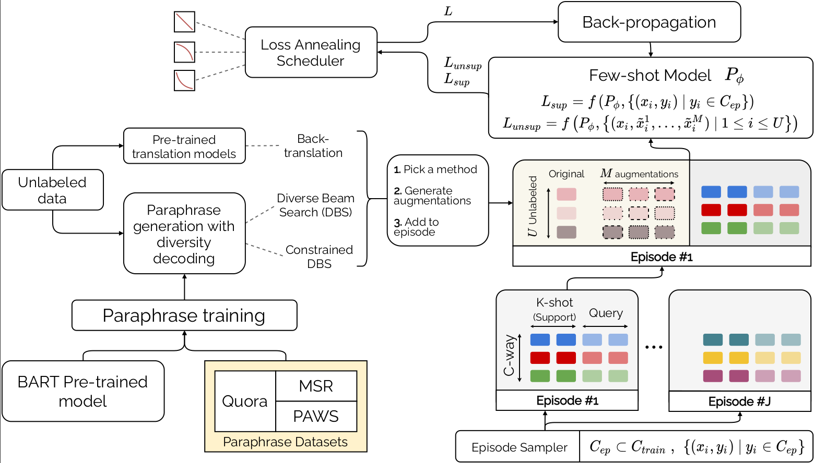

# `PROTAUGMENT`

This repository contains the official code for the paper **PROTAUGMENT: Unsupervised diverse short-texts paraphrasing for intent detection meta-learning**. In this paper, we aim at training a few-shot text classification model. To improve the robustness of our model, we introduced unlabeled data and paraphrases. 

# Setup 

To run this code, we advise to create a specific virtual environment. Please note I used `Python 3.6.9` in my code. Some other versions of python might not work. 
```bash
# Environment creation
python3 -m virtualenv .venv --python=python3.6
```
Then, install the required python libraries
```bash
# Activate environment
source .venv/bin/activate

# Install requirements
pip install -r requirements.txt
```

# Modeling

``PROTAUGMENT`` has the following architecture:



In this framework, two models are used: 
- A paraphrase generation model
- An embedder model (usually a language model), which is used to do few-shot text classification 

## Paraphrase generation Model

The paraphrase generation model is a BART ([article](https://ai.facebook.com/research/publications/bart-denoising-sequence-to-sequence-pre-training-for-natural-language-generation-translation-and-comprehension/), [model](https://huggingface.co/facebook/bart-base)) model, trained on the paraphrase generation task using 3 datasets: Google-PAWS, MSR, Quora. If you want to reproduce the results, the model is available on the 🤗 HuggingFace hub, named `tdopierre/ProtAugment-ParaphraseGenerator`

If you want to use another Seq2Seq model to generate paraphrases, feel free to change the `--paraphrase-model-name-or-path` and `--paraphrase-tokenizer-name-or-path` parameters.

If you want to train your own paraphrase generation model, follow the instructions in the `paraphrase/fine-tune-BART` directory.

## Language Model

For each dataset, we first fine-tune a language model on the dataset, on the masked language modeling task. Such models are available on the 🤗 HuggingFace hub:

| Dataset   | Model Identifier                   | URL |
| :-------- | :-------------------------------- | :---------- |
| BANKING77 | `tdopierre/ProtAugment-LM-BANKING77` | [link](https://huggingface.co/tdopierre/ProtAugment-LM-BANKING77) |
| HWU64     | `tdopierre/ProtAugment-LM-HWU64`     | [link](https://huggingface.co/tdopierre/ProtAugment-LM-HWU64) |
| Clinic150 | `tdopierre/ProtAugment-LM-Clinic150` | [link](https://huggingface.co/tdopierre/ProtAugment-LM-Clinic150) |
| Liu       | `tdopierre/ProtAugment-LM-Liu`       | [link](https://huggingface.co/tdopierre/ProtAugment-LM-Liu)

If you want to fine-tune your own language model, use the scripts available in the `language_modeling` directory. 

# Running `PROTAUGMENT`

If you want to run a single experiment using `PROTAUGMENT`, use `models/proto/protaugment.sh`. This script loads the correct environment and runs the python script `models/proto/protaugment.py`. The shell scripts passes the arguments to the python script, as can be seen in `utils/scripts/run_protaugment.sh`. I tried my best to document the different arguments in the `protaugment.py`. If anything is unclear, please reach out to @tdopierre directly.

To run the experiments obtained in the paper, use  `utils/scripts/protaugment/run_protaugment.sh`
If you are using the [SLURM](https://slurm.schedmd.com/overview.html) job manager, you may use the alternative script `run_protaugment-slurm.sh`. This will break down each individual experiment into a separate job, and hence will run much faster (provided you have adequate hardware).

⚠️ WARNING ⚠️
This script is very long to run, as it contains all experiments reported in the paper.

## Example: Changing paraphrases source

If you have your own paraphrases of unlabeled texts available, you can use them in `PROTAUGMENT` by specifiying the path in the `--augmentation-data-path` argument. As an example, you can have a look at the way I use augmentation issued by back-translation in the `run_protaugment.sh` script.

# References

If you use this code or build upon it in your projects, please cite our paper
```bash
@article{Dopierre2021ProtAugmentUD,
  title={ProtAugment: Unsupervised diverse short-texts paraphrasing for intent detection meta-learning},
  author={Thomas Dopierre and C. Gravier and Wilfried Logerais},
  journal={ArXiv},
  year={2021},
  volume={abs/2105.12995}
}
```
